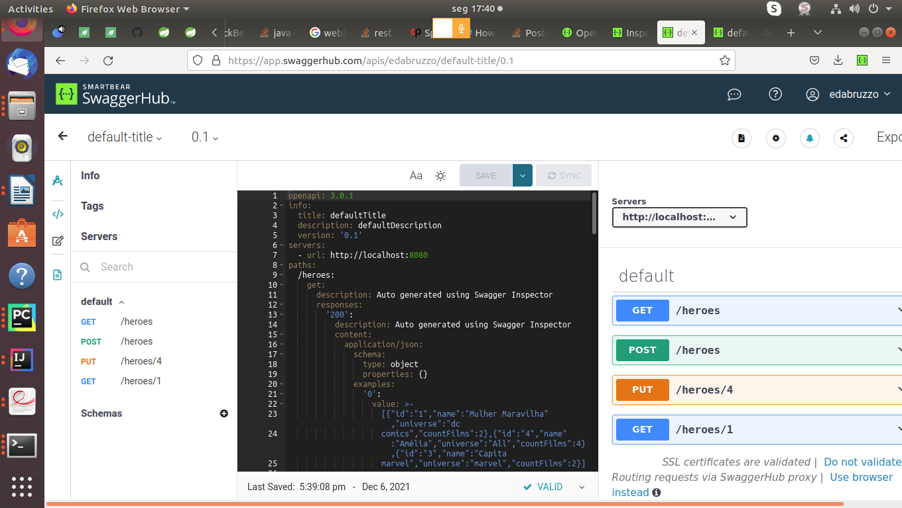
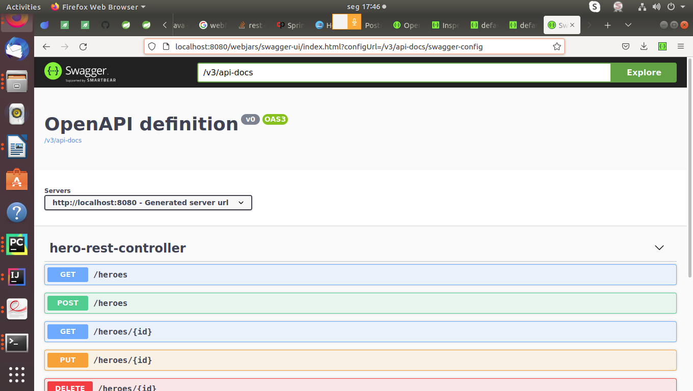

# Java Reactive Application using Spring Webflux - DynamoDB - AWS CLI - Reactor among other stacks
###### O projeto é requisito para conclusão do Bootcamp TQI na Digital Innovation One

## Stack 

  * Java8
  * Spring webflux
  * Spring data
  * Dynamodb
  * Junit
  * sl4j
  * Reactor

### API Documentation

https://app.swaggerhub.com/apis-docs/edabruzzo/default-title/0.1

http://localhost:8080/webjars/swagger-ui/index.html?configUrl=/v3/api-docs/swagger-config

#### HEROES REACTIVE WEBFLUX API
##### Reactive API using WebFlux, DynamoDB, AWS CLI, REACTOR, Spring Framework

#### GET -> Get Hero By ID
    curl --location --request GET 'localhost:8080/heroes/4'

#### POST -> Create new HERO on DynamoDB
    curl --location --request POST 'localhost:8080/heroes/' \
    --header 'Content-Type: application/json' \
    --data-raw '{
    "id":"2",
    "name":"Genoveva",
    "universe":"Encantado",
    "countFilmes":10
    }'

#### GET ALL Heroes
    curl --location --request GET 'localhost:8080/heroes'

#### DELETE RESOURCE BY ID
    curl --location --request DELETE 'localhost:8080/heroes/2'

#### PUT  -> UPDATE HERO BY ID
    curl --location --request PUT 'localhost:8080/heroes/4' \   
    --header 'Content-Type: application/json' \
    --data-raw '{
    "id": "4",
    "name":"Amélia",
    "universe":"All",
    "countFilms":4  
    }'

### Reading - Reactive Manifesto
+ https://www.reactivemanifesto.org/

### Commands
#### DynamoDB
    docker pull amazon/dynamodb-local
    docker run -p 8000:8000 amazon/dynamodb-local

#### Docker Compose
    On project root dir run:

    emmanuel@computer:~/NetBeansProjects/DigitalOne_2/SPRING_WEBFLUX_API_HEROES_EMM/WebFluxReactiveAPI$ sudo docker-compose up -d dynamodb-local
    [sudo] password for emmanuel:
    WARNING: The Docker Engine you're using is running in swarm mode.
    
    Compose does not use swarm mode to deploy services to multiple nodes in a swarm. All containers will be scheduled on the current node.
    
    To deploy your application across the swarm, use `docker stack deploy`.
    
    Creating network "webfluxreactiveapi_default" with the default driver
    Creating dynamodb-local ... done

### Connect to DynamoDB Local programmatically
#### AWS-CLI

    After getting your local DyanamoDB instance successfully set up, now you should be able to see it running on http://localhost:8000 . We can pass this address to AWS-CLI or AWS-SDK as our preferred DynamoDB endpoint URL and start accessing it.
    
    $ aws dynamodb <command> --endpoint-url http://localhost:8000
    
#### JAVA
    DynamoDbClient client = DynamoDbClient.builder()
                            .region(Region.US_WEST_2)
                            .endpointOverride(
                            URI.create("http://localhost:8000"))
                            .build();

#### Python3
    Python (Boto3)
    import boto3# Get the service client
    db = boto3.client('dynamodb',endpoint_url='http://localhost:8000')# Get the service resource
    db = boto3.resource('dynamodb',endpoint_url='http://localhost:8000')

#### NPM NODE
    $ npm install -g dynamodb-admin

    // For Windows
    set DYNAMO_ENDPOINT=http://localhost:8000
    
    dynamodb-admin// For Mac/Linux
    export DYNAMO_ENDPOINT=http://localhost:8000 

    $ dynamodb-admin
    
    Now visit http://localhost:8001 on your web browser to access the dynamodb-admin GUI.

### Reference links: 
#### Project tutorial by Kamilah Santos
+ https://speakerdeck.com/kamilahsantos/live-coding-dio-api-de-herois-com-spring-webflux
   
    #### Baeldung
+ https://www.baeldung.com/spring-data-dynamodb
+ https://github.com/eugenp/tutorials/blob/master/spring-5-reactive-security/src/main/java/com/baeldung/webflux/EmployeeWebClient.java
+ https://www.baeldung.com/spring-webflux
+ https://github.com/eugenp/tutorials/blob/master/spring-5-reactive-security/src/main/java/com/baeldung/webflux/EmployeeWebClient.java
+ https://spring.io/guides/gs/reactive-rest-service/

    #### AWS CLI
+ https://docs.aws.amazon.com/cli/latest/userguide/cli-chap-configure.html

    #### DynamoDB
+ https://docs.aws.amazon.com/cli/latest/userguide/cli-chap-configure.html
    
    #### Swagger
      Documentacao gerada pela aplicação: swagger: 
+ http://localhost:8080/swagger-ui-heroes-reactive-api.html

    #### Docker Compose
+ https://medium.com/platform-engineer/running-aws-dynamodb-local-with-docker-compose-6f75850aba1e

    #### Discussons about Reactive Non Blocked Applications
+ https://medium.com/@nithinmallya4/processing-streaming-data-with-spring-webflux-ed0fc68a14de

    #### Testing Webflux Reactive Applications
+ https://stackoverflow.com/questions/60611730/properly-ways-to-testing-webflux-rest-api
+ https://howtodoinjava.com/spring-webflux/webfluxtest-with-webtestclient/

